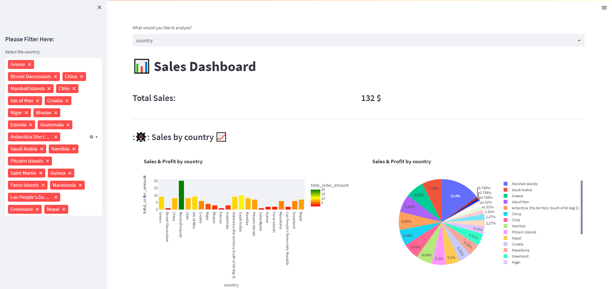

# Building a Real time Data Pipeline with Kafka Spark Streaming

This project is a streaming data pipeline that ingests data from an ecommerce website, processes the data, and loads the data into MongoDB. It also creates a real time dashboard with Streamlit. 

The data pipeline starts by setting up Kafka on the ecommerce website. Kafka will be used to ingest the data from the website in real time. This data will be transformed and processed using Spark Streaming. The processed data will then be loaded into MongoDB. Finally, a real time dashboard will be created using Streamlit to display the data.

The project will allow for real time analytics on the ecommerce website, allowing for more efficient decision making and better customer experience. The data pipeline will make it easier to understand user behavior and trends, which will be beneficial for the website.

# Usage 
- To use this project, execute the command provided in the run.sh file step by step. If everything checks out, visit  dashboard.
# Results
- Get the sales amount by country. 
- 

  

- Get the sales amount by Product Name.
- 

  

- Get the sales amount by gender.
- 

  

## Authors
- Bendra Abdelali
- ELASERY Youssef

